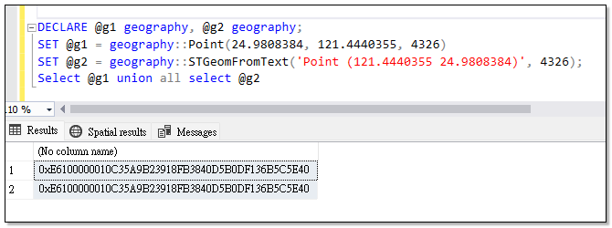
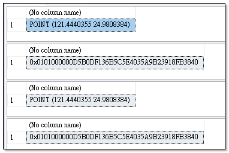
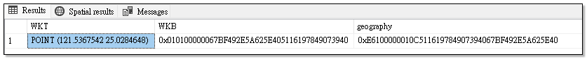
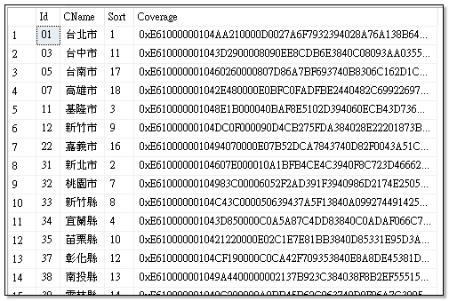
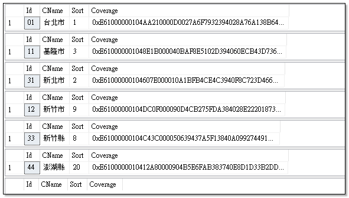
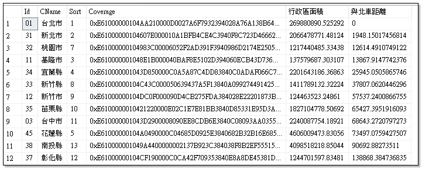

# Spatial Data Types

空間資料大至可區以下類型：

- **geography data type (地理資料)**  

橢球的座標資料（ellipsoidal data），如經緯度（latitude and longitude coordinates）.

- **geometry data type (幾何資料)**  

二維或三維的座標資料（three dimensional data），，適用經過投影過後的座標系統，如台灣常見的TWD97二度分帶座標系統。

- **Open Geospatial Consortium （[OGC](http://en.wikipedia.org/wiki/Open_Geospatial_Consortium)）**  

一種由開放式地理空間協會所定義的地理方法。

# 地理資料類型

MS SQL Server 2008開始支援空間資料類型，主要有兩種：

- **geometry**: 
  
  用來表示平面空間資料 (planar spatial data)，如地圖投影座標系統 (projected coordinate systems)。
  geometry 資料類型同時符合「開放式地理空間協會 (Open Geospatial Consortium, OGC) 的 SQL 簡單特徵規格」1.1.0 版，且符合 SQL MM (ISO 標準)。

- **geography**: 

  用來表示橢球空間資料 (ellipsoidal spatial data)，如經緯度座標系統 (latitude/longitude coordinate systems)。

## 具現化空間資料

要使用空間資料型別，必需利用地理空間資料格式來具現化，這格式依據開放式地理空間協會(OGC)所定義的標準，主要有以下兩種：

### WKT 格式 (Well-Known Text)

WKT 格式是以文字方式來表示空間資料的格式，主要有以下幾種：

- **Point**: 表示一個點 (x, y)。
- **LineString**: 表示一條線段，由多個點所組成。
- **Polygon**: 表示一個多邊形，由多個點所組成，且<span class='text-red'>第一個點與最後一個點必須相同</span>。
- **MultiPoint**: 表示多個點的集合。
- **MultiLineString**: 表示多條線段的集合。
- **MultiPolygon**: 表示多個多邊形的集合。
- **GeometryCollection**: 表示多種幾何圖形的集合。

{: .important}
> SQL Server 的 Geography 欄位對於`多邊形`有以下要求：
>
> - 一個多邊形必有一個外圈 (exterior ring) 與零個或多個內圈 (interior ring, holes)。
> - 外圈的頂點必須是逆時針方向排列。
> - 內圈(洞)的頂點必須是順時針方向排列
> - 不管內圈或外圈，都必須是封閉的，也就是第一個點與最後一個點必須相同。
> - 多邊形的外圈與內圈(洞)不能重疊。

{: .note}
>OGC 的 Point 格式是 (經度 緯度)，而 SQL Server 的 Point 格式是 (緯度,經度)，所以在使用 WKT 格式建立空間資料時，要特別注意這一點。
>
>- 經度 (longitude)：東經和西經的度數各為0度到180度。 
>- 緯度 (latitude) ：北緯和南緯的度數各為0度到90度。



```sql
DECLARE @g1 geography, @g2 geography;   

SET @g1 = geography::Point(25.0284648,121.5367542, 4326)  --台北車站座標
SET @g2 = geography::STGeomFromText('Point (120.3000081 22.6394973)', 4326); --高雄車站座標

Select @g1.STDistance(@g2) --二點距離  293056.080379741 
```


### WKB 格式 (Well-Known Binary)

WKB 格式則是以二進位方式來表示空間資料的格式。

## WKT 與 WKB 的轉換

- WKT 可以用 geometry::STGeomFromText 這個方法轉換成 WKB
- WKB 可以用 geometry::STGeomFromWKB 這個方法轉換成 WKT

```sql
DECLARE @g1 geometry 
DECLARE @g2 geometry 

--由WKT格式建立地理資料
SET @g1 = geometry::STGeomFromText('Point (121.4440355 24.9808384)', 4326);

SELECT @g1.STAsText();    --資料的WKT格式
SELECT @g1.STAsBinary();  --資料的WKB格式

--由WKB格式建立地理資料
Set @g2 = geometry::STGeomFromWKB(0x0101000000D5B0DF136B5C5E4035A9B23918FB3840, 4326)

SELECT @g2.STAsText();    --資料的WKT格式
SELECT @g2.STAsBinary();  --資料的WKB格式
```



不管是 WKT 格式或 WKB 格式，都可以用來建立而 SQL Server 的 geometry 資料，而 SQL Server 實際上都是以 varbinary(max) 格式存放空間資料。
但 geometry 欄位的實際資料含有其他相關資訊，如 SRID (Spatial Reference System Identifier) 等，所以不會等於 WKB，實際上會比 WKB 格式的資料還要大。

```sql
declare @g1 geography = geography::Point(25.0284648,121.5367542, 4326)  ----台北車站座標

Select @g1.STAsText() WKT, @g1.STAsBinary() WKB, @g1 'geography'
```


# 地理資料方法

同樣的, SQL Server 依據 OGC 標準，也提供了許多方法來操作空間資料, 以下是一些常用的方法:

| 方法 | 說明 |
| ---- | ---- |
| STArea() | 計算面積 |
| STLength() | 計算長度 |
| STDistance() | 計算兩個空間資料的距離 |
| STIntersects() | 判斷兩個空間資料是否相交 |
| STIntersection() | 取得兩個空間資料的交集 |
| STUnion() | 合併兩個空間資料 |
| STDifference() | 取得兩個空間資料的差集 |
| STNumPoints() | 取得空間資料的點數 |
| STContains() | 執行個體是否包含參數那個空間資料 |
| STWithin() | 執行個體是否位於參數那個空間資料　|
| STGeometryType() | 取得空間資料的類型 |
| STAsText() | 取得空間資料的 WKT 格式 |
| STAsBinary() | 取得空間資料的 WKB 格式 |
| STGeomFromText() | 由 WKT 格式建立空間資料 |
| STGeomFromWKB() | 由 WKB 格式建立空間資料 |

## 查詢範例

由 [國土測量圖資](https://whgis-nlsc.moi.gov.tw/Opendata/Files.aspx)網站上的「直轄市、縣市界線(TWD97經緯度)1140318」，可以取得各縣市的行政區域界線資料。


將界線資料資料轉成 geography 之後，就可以透過 OGC 方法進行查詢。

### 查詢座標落在哪一個縣市

```sql
DECLARE @g1 geography

SET @g1 = geography::Point(25.0284648,121.5367542, 4326)  --台北車站座標
select * from Country where Coverage.STContains(@g1)=1

SET @g1 = geography::Point(25.132654, 121.739822, 4326)   --基隆車站座標
select * from Country where Coverage.STContains(@g1)=1

SET @g1 = geography::Point(25.132260, 121.425006, 4326)   --觀音山座標
select * from Country where Coverage.STContains(@g1)=1

SET @g1 = geography::Point(24.801805, 120.971602, 4326)   --新竹車站座標
select * from Country where Coverage.STContains(@g1)=1

SET @g1 = geography::Point(24.808227, 121.041279, 4326)   --竹北高鐵站座標
select * from Country where Coverage.STContains(@g1)=1

SET @g1 = geography::Point(23.211390, 119.418015, 4326)   --澎湖七美機場
select * from Country where Coverage.STContains(@g1)=1

SET @g1 = geography::Point(23.235220, 119.484372, 4326)   --澎湖海域
select * from Country where Coverage.STContains(@g1)=1
```


### 計算每個縣市的大小以及離台北車站的距離

```sql
declare @g1 geography = geography::Point(25.0284648,121.5367542, 4326)  ----台北車站座標

select *, Coverage.STArea() 行政區面積, Coverage.STDistance(@g1) AS 與北車距離 from country order by Coverage.STDistance(@g1)
```


## 參考資料
- <a target="_blank" href="https://learn.microsoft.com/zh-tw/sql/relational-databases/spatial/spatial-data-types-overview?view=sql-server-ver17">空間資料類型概觀</a>
