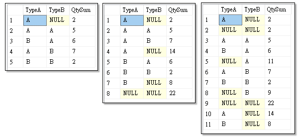
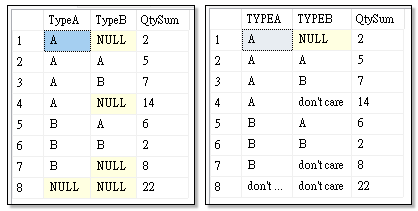
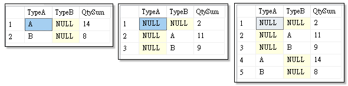
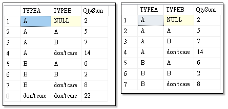

GROUP BY 的延伸類型有：

- GROUP BY... [WITH ROLLUP](#使用-with-rollup-和-with-cube-子句)
- GROUP BY... [WITH CUBE](#使用-with-rollup-和-with-cube-子句)
- GROUP BY... [GROUPING](#使用-grouping-彙總函式)
- GROUP BY... [GROUPING SETS](#使用-grouping-sets)
- GROUP BY... [CUBE]()
- GROUP BY... [ROLLUP]()

## 使用 WITH ROLLUP 和 WITH CUBE 子句

`WITH ROLLUP`、`WITH CUBE`和`GROUPING`都是`GROUP BY`的擴充子句。  
`WITH ROLLUP`和`WITH CUBE`子句是 SQL2005 的新功能，這二個運算子可用來產生包含小計與總數的報告。

以下是`CUBE`與`ROLLUP`之間的差異：
- WITH ROLLUP：傳回的結果集，除了 Group By 的彙總資料外，另外會針對各個欄位做階層式的彙總。
- WITH CUBE：傳回的結果集，除了 Group By 的彙總資料外，另外會針對各個欄位做排列組合式的彙總。

```sql
DECLARE @List table( 
	TypeA char(1),
	TypeB char(1),
	TypeC char(1),
	Qty int
);
insert @List values ('A','A', 3)
insert @List values ('A','B', 4)
insert @List values ('B','A', 5)
insert @List values ('A','B', 3)
insert @List values ('A','A', 2)
insert @List values ('B','B', 2)
insert @List values ('B','A', 1)
insert @List values ('A', null, 2)

SELECT TypeA,TypeB,TypeC,SUM(Qty) AS QtySum
FROM @List
GROUP BY TypeA,TypeB,TypeC 

-- ROLLUP 會另外針對各個欄位做階層式的小計彙總
SELECT TypeA,TypeB,TypeC,SUM(Qty) AS QtySum
FROM @List
GROUP BY TypeA,TypeB,TypeC 
WITH ROLLUP  

-- CUBE 會另外針對各個欄位做排列組合式的小計彙總
SELECT TypeA,TypeB,TypeC,SUM(Qty) AS QtySum
FROM @List
GROUP BY TypeA,TypeB,TypeC 
WITH CUBE  
```


{: .note}
> [CHECKSUM_AGG](http://msdn.microsoft.com/zh-tw/library/ms188920.aspx) 函式不支援 ROLLUP、CUBE、GROUPING SETS。<br>
> [WITH CUBE](http://msdn.microsoft.com/zh-tw/library/bb522495.aspx) 運算子的統計資訊會將回傳的結果集快速的澎漲，所以資料量大的查詢應避免使用。

## 使用 GROUPING 彙總函式

當使用 Rollup 或 Cube 子句時，若回傳結果集中含有 Null 欄位，是無法分辯出是階層式小計彙總的 Null 還是正常資料列中的 Null。
此時可以用 [GROUPING](http://msdn.microsoft.com/zh-tw/library/ms178544.aspx) 函式來辯識是否為彙總資料欄。 

`GROUPING`關鍵字在二個地方會使用到：

- 若使用在 `SELECT` 子句中，它是用來判別該資料列是否為小計的資訊列。
- 若使用在 `GROUP BY` 子句中，它是用來自訂統計的群組。

若 [GROUPING](http://msdn.microsoft.com/zh-tw/library/ms178544.aspx) 回傳 1 ，表示該筆資料是以此欄位為彙總，若不是則回傳 0 。  

```sql
SELECT TypeA,TypeB,SUM(Qty) AS QtySum
FROM @List
GROUP BY TypeA,TypeB WITH ROLLUP  

SELECT 
CASE WHEN (GROUPING(TypeA)=1) THEN 'don''t care' ELSE TypeA END as TYPEA,
CASE WHEN (GROUPING(TypeB)=1) THEN 'don''t care' ELSE TypeB END as TYPEB,
SUM(Qty) AS QtySum
FROM @List
GROUP BY TypeA,TypeB WITH ROLLUP  
```


## 使用 GROUPING SETS

[GROUPING SETS](http://msdn.microsoft.com/zh-tw/library/bb510427.aspx) 是 SQL2008 的新功能。

使用 [GROUPING SETS](http://msdn.microsoft.com/zh-tw/library/bb510427.aspx) ，相同於 [UNION ALL](http://msdn.microsoft.com/zh-tw/library/ms180026.aspx) 所有的 [GROUP BY](http://technet.microsoft.com/zh-tw/library/ms177673.aspx) 單個項目。
```sql
...
GROUP BY GROUPING SETS (C1,C2,C3) 
```
```sql
... GROUP BY C1
UNION ALL
... GROUP BY C2
UNION ALL
... GROUP BY C3
```

### 單一集合

> GROUPING SETS ((TypeA,TypeB))

括號裡面只有一個子集合，等同於使用 GROUP BY TypeA,TypeB

```sql
SELECT TypeA,TypeB,SUM(Qty) AS QtySum FROM @List GROUP BY TypeA, TypeB

SELECT TypeA,TypeB,SUM(Qty) AS QtySum FROM @List GROUP BY GROUPING SETS ((TypeA, TypeB))
```


### 複合集合

> GROUPING SETS (TypeA,TypeB) <br>
> GROUPING SETS ((TypeA),(TypeB))

這二行是同義的，括號裡面有多個子集合(複合元素)，等同於 GROUP BY 各個元素後，再做 UNION ALL 。

在 GROUPING SETS 中使用複合元素 (composite elements) 。每個複合元素會被視為一個資料行。

也就是說當 GROUPING SETS 中有多個子集合，那麼就等同 GROUP BY 各個元素後，再做 UNION ALL。

```sql
SELECT TypeA, Null as TypeB,SUM(Qty) AS QtySum FROM @List GROUP BY TypeA
SELECT Null as TypeA, TypeB,SUM(Qty) AS QtySum FROM @List GROUP BY TypeB
SELECT TypeA,TypeB,SUM(Qty) AS QtySum FROM @List GROUP BY GROUPING SETS (TypeA, TypeB)
```




### 例三

由前面介紹可以知道 ROLLUP 或 CUBE 可以在結果集中加入小計的資料列，但是如果你不需要那麼多種組合的小計，就可以使用 GROUPING SETS 只指定您想要的群組。  

例如，下面例子中，若只想取得 TypeA 的小計，就可以這麼使用：  
```sql
--使用 ROLLUP 會產生所有可能的群組小計
SELECT 
CASE WHEN (GROUPING(TypeA)=1) THEN 'don''t care' ELSE TypeA END as TYPEA,
CASE WHEN (GROUPING(TypeB)=1) THEN 'don''t care' ELSE TypeB END as TYPEB,
SUM(Qty) AS QtySum FROM @List
GROUP BY TypeA,TypeB With ROLLUP

--使用 GROUPING SETS 可以指定群組做小計
SELECT 
CASE WHEN (GROUPING(TypeA)=1) THEN 'don''t care' ELSE TypeA END as TYPEA,
CASE WHEN (GROUPING(TypeB)=1) THEN 'don''t care' ELSE TypeB END as TYPEB,
SUM(Qty) AS QtySum
FROM @List
GROUP BY GROUPING SETS ((TypeA,TypeB),(TypeA))
```

