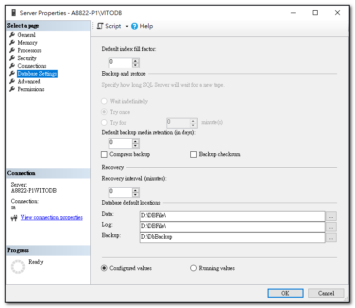

安裝好 SQL Server 2019 之後，資料檔和備份檔的預設路徑會在 C:\Program Files\Microsoft SQL Server\MSSQL15.XXXXXX\MSSQL 目錄下的 Data 和 Backup 資料夾。
若要變更預設的資料庫目錄，可以直接透 SSMS 更改即可。

## 變更資料庫預設目錄

右鍵點選 SQL Server 執行個體，開啟 [屬性]視窗。

{: .note}
>Data 和 Log 這二個屬性值變更完之後，必須重啟 SQL Server 服務才會生效。

