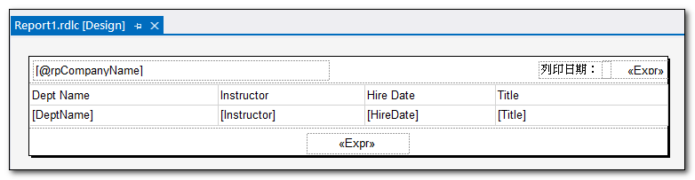

## 前言

要新增或編輯 rdlc 檔案，必須先安裝[Microsoft RDLC Report Designer 2022 擴充工具](https://marketplace.visualstudio.com/items?itemName=ProBITools.MicrosoftRdlcReportDesignerforVisualStudio2022)。
不過目前 .Ｎet Core Ｗeb 專案，尚不支援在專案中直接新增報表項目(rdlc 檔案)，但是可以由別的類型專案中，複製過來使用。
所以，可以開一個 ＷinForm 專案，或者 .Ｎet Ｗeb 專案，來管理這些 rdlc 檔案，再複製到 .Ｎet Core Ｗeb 專案中使用。

在過去的 Asp.Net Web From 專案中，有了 rdlc 檔案之後，就可以使用 ReportViewer 控制項，來顯示報表內容，並且可以將報表內容匯出成 Excel, Word 以及 PDF 的檔案格式進行下載。
但是在 .Ｎet Core Ｗeb 專案中，沒有 ReportViewer 控制項，要顯示報表內容，可以透過 [ReportViewerCore.NETCore](https://www.nuget.org/packages/ReportViewerCore.NETCore/) 套件來達成。
這個套件是由 SSRS 裡頭的程式碼移植到 .NET 8，套件裡頭提供的 LocalReport 物件，雖然不能像 ReportViewer 控制項一樣，自動生成預覽頁面，但是可以將 rdlc 報表內容，直接生成 Excel, Word 以及 PDF 的檔案。

## 安裝必要套件

- [Microsoft RDLC Report Designer 2022 擴充工具](https://marketplace.visualstudio.com/items?itemName=ProBITools.MicrosoftRdlcReportDesignerforVisualStudio2022)
  
  這個擴充工具是用來新增或編輯 rdlc 檔案。

- [ReportViewerCore.NETCore 套件](https://www.nuget.org/packages/ReportViewerCore.NETCore/)

  這個套件可以將 rdlc 報表內容，轉成 Excel, Word 以及 PDF 的檔案。

## 建立 RDLC 檔案

1. 在 ＷinForm 專案，或者 .Ｎet Ｗeb 專案，新增一個 rdlc 檔案。

   
   

1. 將編輯好的 rdlc 檔案，複製到 .Ｎet Core Ｗeb 專案。

1. 變更 .Ｎet Core Ｗeb 專案中的 rdlc 的輸出屬性。

   

## 輸出報表內容

```csharp
public IActionResult Report()
{
    //設定rdlc檔案路徑
    LocalReport localReport = new()
    {
        ReportPath = $@"{this._hostingEnvironment.ContentRootPath}\Reports\Report1.rdlc"
    };

    //設定報表的資料來源
    DataTable dataTable = GetInstructorCourse();
    localReport.DataSources.Add(new ReportDataSource("DataSet1", dataTable));

    //設定傳進報表中的參數
    localReport.SetParameters(new ReportParameter("rpCompanyName", "CompanyName"));

    //將報表輸出成檔案
    string outputPath = $@"{this._hostingEnvironment.ContentRootPath}\Tmp\{Guid.NewGuid()}.rdlc";
    var reportData = localReport.Render("PDF");
    using (FileStream fileStream = new(outputPath, FileMode.Create, FileAccess.Write, FileShare.None))
    {
        fileStream.Write(reportData, 0, reportData.Length);
    }
    return File(reportData, "application/pdf");
}
```


