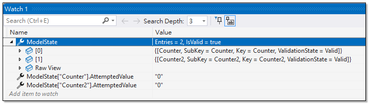
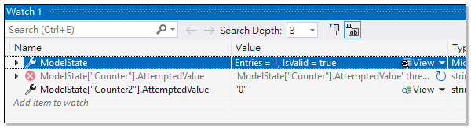
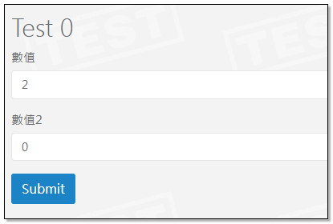
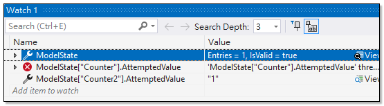
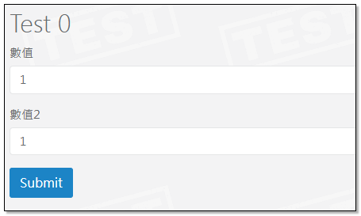

## Model State

ModelState 物件是 ControllerBase 裡的一個屬性, 當 request 進來時, 它會記錄 post back 的模型資料以及驗證結果。
另外，當 View 在做 Model Binding 時,也會優先選擇 ModelState 中的欄位值，而不是 Model 本身的實際值。
這可確保如果表單提交未通過驗證，使用者先前輸入的（無效）資料會顯示在表單欄位中，從而允許他們更正它，而無需重新輸入所有內容。

```html
@model Hiking.Controllers.TestViewModel

<h1>Test</h1>

<div class="row">
    <form asp-action="Test">
        <div asp-validation-summary="ModelOnly" class="text-danger"></div>
        <div class="form-group">
            <label asp-for="Counter" class="control-label"></label>
            <input asp-for="Counter" class="form-control" />
            <span asp-validation-for="Counter" class="text-danger"></span>
        </div>
        <div class="form-group">
            <label asp-for="Counter2" class="control-label"></label>
            <input asp-for="Counter2" class="form-control" />
            <span asp-validation-for="Counter2" class="text-danger"></span>
        </div>
        <div class="form-group">
            <input type="submit" value="Submit" class="btn btn-primary" />
        </div>
    </form>
</div>
```
```c#
[HttpGet]
public IActionResult Test()
{
    var model = new TestViewModel();
    return View(model);
}

[HttpPost]
public IActionResult Test(TestViewModel model)
{
    if (!ModelState.IsValid)
    {
        ModelState.AddModelError(string.Empty, "模型驗證失敗，請檢查輸入的資料。");
    }
    else if (int.TryParse(model.Counter, out int counter) && int.TryParse(model.Counter2, out int counter2))
    {
        model.Counter = (++counter).ToString();
        model.Counter2 = (++counter2).ToString();
    }
    else
    {
        ModelState.AddModelError("", "模型驗證失敗，輸入的資料不是數字。");
    }
    return View(model);
}

public class TestViewModel
{
    [Required]
    [Display(Name = "數值")]
    [StringLength(6, ErrorMessage = "最多6個數字")]
    public string Counter { get; set; } = "0";

    [Required]
    [Display(Name = "數值2")]
    [StringLength(6, ErrorMessage = "最多6個數字")]
    public string Counter2 { get; set; } = "0";
}
```


上面程式碼,雖然我們在Controller中變更了 model 的 Counter 數值, 但是 View 顯示的依然是變更前的舊值, 這就是 View 在做 Model Binding 時,會優先選擇 ModelState 中的欄位值，而不是 Model 本身的實際值。




### 如何顯示更新後的 Model 內容

既然 ModelState 優先於 Model , 要顯示 Model 內容, 只要移除 ModelState 內容即可.

```c#
[HttpPost]
public IActionResult Test(TestViewModel model)
{
    if (!ModelState.IsValid)
    {
        ModelState.AddModelError(string.Empty, "模型驗證失敗，請檢查輸入的資料。");
    }
    else if (int.TryParse(model.Counter, out int counter) && int.TryParse(model.Counter2, out int counter2))
    {
        model.Counter = (++counter).ToString();
        model.Counter2 = (++counter2).ToString();

        ModelState.Remove(nameof(model.Counter));
    }
    else
    {
        ModelState.AddModelError("", "模型驗證失敗，輸入的資料不是數字。");
    }
    return View(model);
}
```

Counter 移除後,ModelState 只剩 Counter2 這個項目。



ModelState 少了 Counter 這個項目，繫結時只能由 Model 本身取得資料值。




### 如何更新 ModelState 內容

ModelState 的 SetModelValue 可以變更 ModelState 內容。
```c#
[HttpPost]
public IActionResult Test(TestViewModel model)
{
    if (!ModelState.IsValid)
    {
        ModelState.AddModelError(string.Empty, "模型驗證失敗，請檢查輸入的資料。");
    }
    else if (int.TryParse(model.Counter, out int counter) && int.TryParse(model.Counter2, out int counter2))
    {
        model.Counter = (++counter).ToString();
        model.Counter2 = (++counter2).ToString();

        ModelState.Remove(nameof(model.Counter));

        ModelState.SetModelValue(nameof(model.Counter2), new ValueProviderResult(model.Counter2, CultureInfo.InvariantCulture));
    }
    else
    {
        ModelState.AddModelError("", "模型驗證失敗，輸入的資料不是數字。");
    }
    return View(model);
}
```



因為我們變更了 ModelState["Counter2"] 這個項目內容，繫結時 Counter2 顯示的自然是變更後的內容。



### 在 View 中讀取 ModelState 內容

即然 View 在生成時, 會優先使用  ModelState 的資料值, 自然我們就可以在 View 中取得 ModelState 的相關資訊。


```html
@model Hiking.Controllers.TestViewModel

<h1>Test @(ViewData.ModelState["Counter2"]?.AttemptedValue ?? "0")</h1>

...
```


