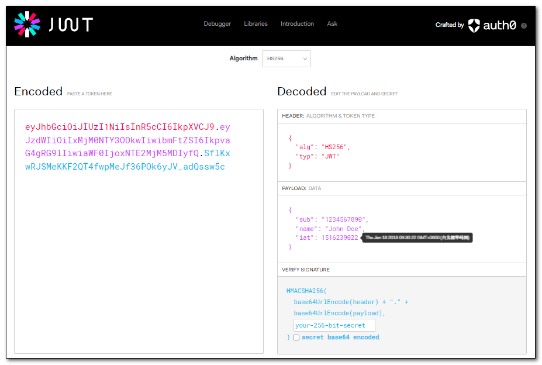

## 什麼是 JSON Web Token (JWT)

將一組 JSON 資料編碼成一個 JSON Web Token (JWT) 字串，並使用密碼或公私金鑰對其進行簽名，以確保資料在傳輸過程中不被竄改。

JWT 由三部分組成，分別是 Header、Payload 和 Signature，這三部分都是用 Base64 編碼，之間使用點號 `.` 進行分隔。

- HEADER（標頭）：包含了 JWT 的類型和使用的加密演算法。
- PAYLOAD（負載）：包含了 JWT 的實際資料內容，也就是一組 JSON 資料。
- VERIFY SIGNATURE（驗證簽名）：簽名，用於驗證 JWT 是否為真實的。



簽名是由 Header 和 Payload 使用 Base64 編碼後的字串，再加上一個密碼（使用指定的加密演算法進行加密）而成。
也就是：
```
HMACSHA256(base64UrlEncode(header) + "." + base64UrlEncode(payload), secret)
```

### 手刻 JWT

```csharp
    var header = new
    {
        alg = "HS256",
        typ = "JWT"
    };
    var payload = new
    {
        sub = "1234567890",
        name = "John Doe",
        iat = "1516239022"
    };
    var key = "pQeP5X9wejpFfQGgSjyWB8iFdLDGHEV8";

    // Cereate  JWT

    byte[] headerByte = Encoding.Default.GetBytes(JsonConvert.SerializeObject(header));
    byte[] payloadByte = Encoding.Default.GetBytes(JsonConvert.SerializeObject(payload));

    string headerBase64 = Convert.ToBase64String(headerByte).TrimEnd('=');
    string payloadBase64 = Convert.ToBase64String(payloadByte).TrimEnd('=');
    var signatureByte = TSecurity.HMACSHA256($"{headerBase64}.{payloadBase64}", key);
    string signatureBase64 = Convert.ToBase64String(signatureByte).TrimEnd('=');

    string tokenString = $"{headerBase64}.{payloadBase64}.{signatureBase64}";

    // Decode JWT

    var handler = new JwtSecurityTokenHandler();
    var jwtSecurityToken = handler.ReadJwtToken(tokenString);
    var claims = jwtSecurityToken.Claims.ToList();
    foreach (var claim in claims)
    {
        Debug.WriteLine($"{claim.Type} {claim.Value}");
    } 
```
```csharp
    public static byte[] HMACSHA256(this string value, string key)
    {
        byte[] messageBytes = Encoding.Default.GetBytes(value);
        byte[] keyByte = Encoding.Default.GetBytes(key);
        using (var hmacSHA256 = new HMACSHA256(keyByte))
        {
            byte[] hashMessage = hmacSHA256.ComputeHash(messageBytes);
            return hashMessage;
        }
    }
```

### 使用現有套件建立 JWT
Nuget安裝套件:
- System.IdentityModel.Tokens.Jwt;
- Microsoft.IdentityModel.Tokens;

```csharp
    var key = "pQeP5X9wejpFfQGgSjyWB8iFdLDGHEV8";
    var securityKey = new SymmetricSecurityKey(Encoding.Default.GetBytes(key));
    var creds = new SigningCredentials(securityKey, SecurityAlgorithms.HmacSha256);

    var header = new JwtHeader(creds);
    var payload = new JwtPayload
    {
        { "sub", "1234567890" },
        { "name", "John Doe" },
        { "iat", "1516239022" }
    };

    var handler = new JwtSecurityTokenHandler();

    // Cereate  JWT

    var token = new JwtSecurityToken(header, payload);            
    string tokenString = handler.WriteToken(token);

    // Decode JWT
    var jwtSecurityToken = handler.ReadJwtToken(tokenString);
    var claims = jwtSecurityToken.Claims.ToList();
    foreach (var claim in claims)
    {
        Debug.WriteLine($"{claim.Type} {claim.Value}");
    }
```
