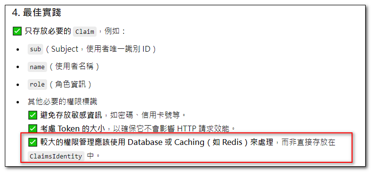

## 這裡記錄一些 Dot Net 常見的問題與解決方法
<br>


{: .highlight}
> 如何將 filter 中的資料，提供給外部程式碼使用？

可以在 filter 中將資料儲存在 HttpContext.Items ，然後由外部程式碼取得使用。
```
public void OnAuthorization(AuthorizationFilterContext filterContext)
{
	...
	filterContext.HttpContext.Items["key"] = permission;
}
```
之後在外部(Controller或View)，都可以透過 HttpContext.Items 取得資料。
```
var permission = HttpContext.Items["key"];
```

{: .highlight}
> 在 ClaimsIdentity 中, 於入很多claim , 合適嗎?

沒人可以討論，所以問了 Chatgpt，覺得回達的很不錯。ＸＤ



### 結論

如果 ClaimsIdentity 內的 Claim 數量較少且僅存放基本身份資訊，那是合適的。但如果數量龐大，應該考慮其他解決方案，例如透過 Database 或 Caching 來查詢額外資訊，而不是全部塞進 ClaimsIdentity。


## 參考資料
- <a target="_blank" href="">XXXXXXXX</a>
- <a target="_blank" href="">XXXXXXXX</a>
- <a target="_blank" href="">XXXXXXXX</a>
- <a target="_blank" href="">XXXXXXXX</a>