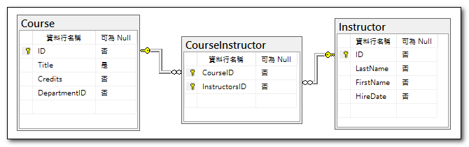
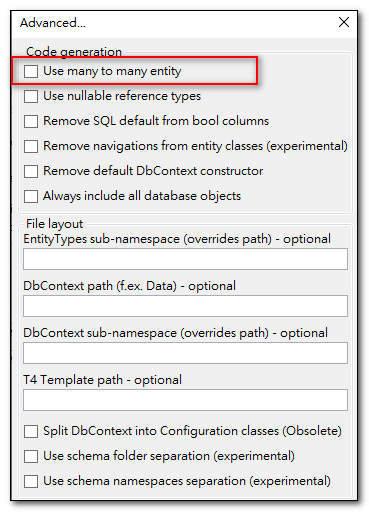
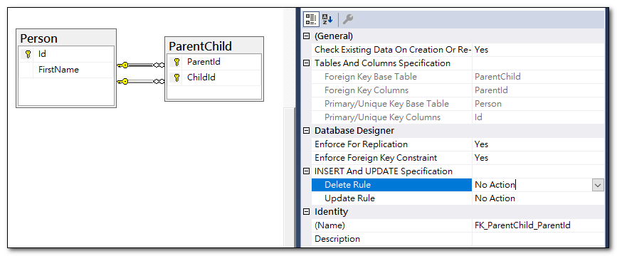

當我們在資料庫的資料表中建立關聯性時，透過 EF Core Power Tools 反向工程建立資料庫模型，它會將關聯性資料，以集合型別的參考屬性來呈現。

下方資料關聯圖中，我們有一個 `Instructor` 實體，它有一個關聯的 Office 和 Expreiences 資料。


透過反向工程建立的資料庫模型，在 `Instructor` 實體中，我們可以看到 `Office` 和 `Experiences` 屬性，這兩個屬性都是參考到 `Instructor` 實體的外部鍵。
```csharp
// Principal (parent)
public partial class Instructor
{
    public int Id { get; set; }
    public string LastName { get; set; }
    public string FirstName { get; set; }
    public DateTime HireDate { get; set; }
    public virtual ICollection<Experience> Experiences { get; set; } = new List<Experience>();
    public virtual Office? Office { get; set; }
}
// Dependent (child)
public partial class Office
{
    public int InstructorId { get; set; }
    public string? Location { get; set; }
    public virtual Instructor Instructor { get; set; } = null!;
}
// Dependent (child)
public partial class Experience
{
    public int SerNo { get; set; }
    public int InstructorId { get; set; }
    public string Description { get; set; } = null!;
    public virtual Instructor Instructor { get; set; } = null!;
}
```
## 一對多關聯

在上述程式碼中，`Instructor` 與 `Experience` 是「一對多關聯」，`Instructor` 實體有一個 `Experiences` 屬性，它是一個`集合`物件，代表一個 `Instructor` 可以有多個 `Experience`。
這種屬性稱為<a target="_blank" href="https://learn.microsoft.com/en-us/ef/core/modeling/relationships/navigations#collection-navigations">集合導覽屬性</a>，它是一個集合物件，可以存放多個相關聯的實體物件。

## 一對一關聯

上述程式碼中，`Instructor` 與 `Office` 是「一對一關聯」，`Instructor` 實體有一個 `Office` 屬性，它是一個`實體`物件，代表一個 `Instructor` 只能有一個 `Office`。
這種屬性稱為<a target="_blank" href="https://learn.microsoft.com/en-us/ef/core/modeling/relationships/navigations#reference-navigations">參考導覽屬性</a>，它是一個實體物件，可以存放一個相關聯的實體物件。

反過來看，`Office` 也有一個 `Instructor` 屬性，這稱為「雙向關聯性」，一個從相依至主體，另一個從主體反轉為相依。

不過，此處的`Instructor`為主體，`Office` 為相依，所以一個`Instructor`物件，不一定要存在一個`Office`；但是要生成一個`Office`物件，則必定先存在一個`Instructor`。

```csharp
var instructor = new Instructor { FirstName = "vito", LastName = "shao" };
dbContext.Instructors.Add(instructor);
dbContext.SaveChanges();
//單純建立 instructor, 可以成功.

var office = new Office { Location = "SouthLake" };
dbContext.Offices.Add(office);
dbContext.SaveChanges();

//上面這段程式碼會產生錯誤, The value of 'Office.InstructorID' is unknown
//因為 EF Core 不知道這個 Office 是屬於哪一個 Instructor
//可以像下面這樣指定 InstructorId

var office = new Office { Location = "SouthLake" };
instructor.Office = office;
dbContext.SaveChanges();
```

## 多對多關聯

多對多關聯是指兩個實體之間有多個對應關係，例如一個 `Instructor` 可以有多個 `Course`，而一個 `Course` 也可以有多個 `Instructor`。



要建立多對多關聯，我們需要在資料庫中建立一個中介表，例如 `CourseInstructor`，它包含 `InstructorId` 和 `CourseId` 兩個外部鍵，分別參考到 `Instructor` 和 `Course` 實體。
然後在 EF Core Power 的進階選項中，**不要勾選**「Use Many to Many Entity」，反向工程就不會產生中介表的實體物件，只會在 OnModelCreating 中，建立多對多的關聯性。



```csharp
public partial class Course
{
    public int Id { get; set; }
    public string? Title { get; set; }
    public int Credits { get; set; }
    public int DepartmentId { get; set; }
    public virtual ICollection<Instructor> Instructors { get; set; } = new List<Instructor>();
}

public partial class Instructor
{
    public int Id { get; set; }
    public string LastName { get; set; }
    public string FirstName { get; set; }
    public DateTime HireDate { get; set; }
    public virtual ICollection<Experience> Experiences { get; set; } = new List<Experience>();
}
```

下方程式碼示範如何列出某一教師的所有課程，以及如何列出某一課程的所有教師。

```csharp
// 由教師取得所有課程
Instructor instructor = _dbContext.Instructors.First();
foreach (var course in instructor.Courses)
{
    Debug.WriteLine(course.Title);
}

// 由課程取得所有教師
Course course = _dbContext.Courses.First();
foreach (var instructor in course.Instructors)
{
    .WriteLine(instructor.LastName);
}
```

## 序列化的循環參考問題

因為多對多關聯，二個實體物件會互相參考，當我們要序列化實體物件時，可能會遇到循環參考問題。

## 自我參考關聯

在一個資料表中，可能會有自我參考關聯，也就是資料表中的某個欄位參考到同一資料表中的另一個欄位。

### 一對多自我參考關聯

例如下圖中 `ParentId` 欄位參考到 `Id` 欄位，這種關聯性稱為「一對多自我參考關聯」。


預設狀況下，Power Tools 反向工程會使用 Inverse 字眼建立集合導覽屬性。
```csharp
public partial class Organization
{
    public int Id { get; set; }
    public string OrgName { get; set; }
    public int? ParentId { get; set; }
    public virtual ICollection<Organization> InverseParent { get; set; } = new List<Organization>();
    public virtual Organization Parent { get; set; }
}
```

### 多對多自我參考關聯

這種關聯性，需要在資料庫中建立一個中介表，例如 `ParentChild`，它包含 `ParentId` 和 `ChildId` 兩個外部鍵，分別參考到 `Person` 實體。



Power Tools 反向工程會在主實體中同時建立二個集合導覽屬性。
```csharp
public partial class Person
{
    public int Id { get; set; }
    public string FirstName { get; set; }
    public virtual ICollection<Person> Children { get; set; } = new List<Person>();
    public virtual ICollection<Person> Parents { get; set; } = new List<Person>();
}
```

## 參考資料
- <a target="_blank" href="https://learn.microsoft.com/en-us/ef/core/modeling/relationships">Introduction to relationships</a>
