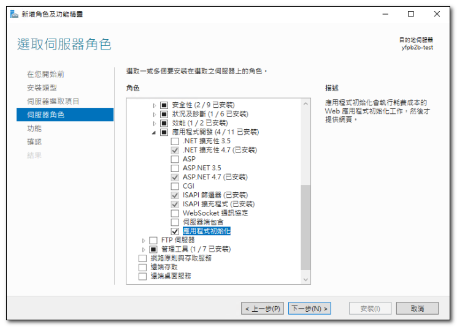
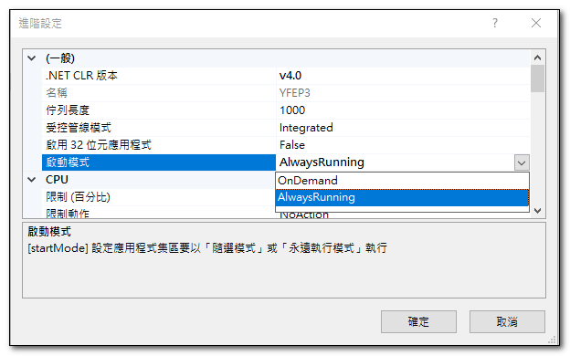
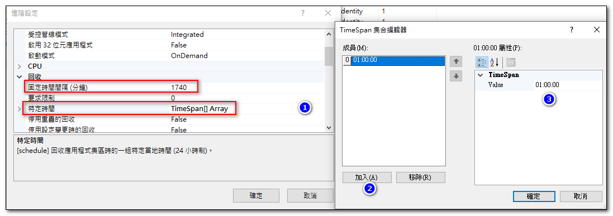
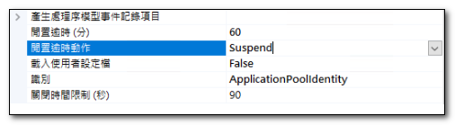
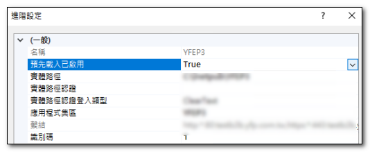
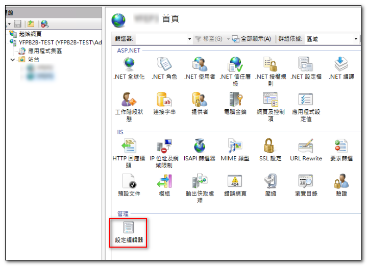

{: .highlight }
>啟用 IIS 預先載入的功能，可以讓 IIS 重啟或者集區回收之後將服務自動起來，而非使用者連線後才啟動服務，避免使用者啟動服務過程感到緩慢體驗不佳。

## 設定步驟
IIS 安裝時必須要包括「應用程式初始化」

## 應用程式集區的設定

### 啟動模式 
調整為 AlwaysRunning
- AlwaysRunning : 永遠保持啟動狀態，不會因為沒有使用者存取而關閉。
- OnDemand：只有當有使用者存取網站時，才會啟動。若時間間隔內一直沒有使用者存取網站，IIS 也會將 Application Pool 關閉。
 

### 回收時間間隔
調整為 0 (永不回收)

- 從 IIS6 起，Application Pool 就有定期重啟機制，以解決程式跑久可能出現記憶體洩漏(Memory Leaking)的問題。這個屬性預設值為 1740 分, 也就是每隔 29 小時，IIS 會定期啟動回收(Recyling)機制。
- 如果設定為 0, 則表示永遠不啟動回收。
- 可透過「特定時間」的屬性，指定離鋒時間來啟動回收機制。

### 閒置逾時動作

## 網站進階設定

### 啟用預先載入

## 網站編輯器的設定
1. 選擇 設定編輯器
2. 區段 選擇 system.webServer/applicationInitialization
3. doAppInitAfterRestart 設定為 True

