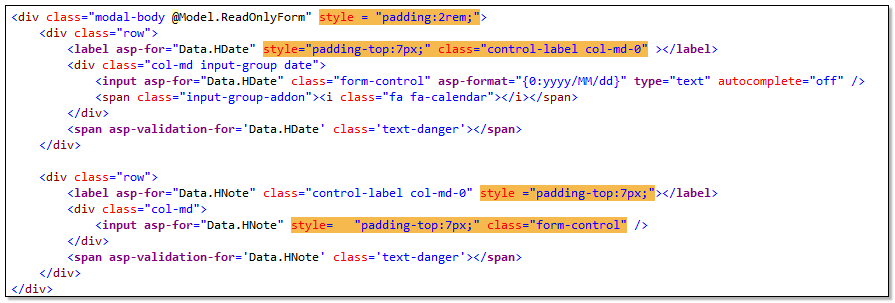
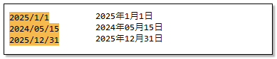

在使用 Visual Studio 編輯器的搜尋功能時，一般我們會透過文字模式進行比對，除此之外，更可以透過 Regex 比對模式，完成較複雜的搜尋需求。

使用 Regex 搜尋功能時，還可以使用「擷取群組」，取得目標字串中的`子字串`，然後使用 $1 $2 $3 ... 將子字串套用到取代字串中的特定位置。

## 範例一　使用 regex 搜尋取代

### 1-1
下面範例中，我們想要移除所有 c# 標籤中的 style 屬性內容。
```
Find：(style)\s*=\s*\"(.*)\"
Replace：
```


上面搜尋到的結果，連同 class 屬性都包含了，所以調整 Regex 搜尋式子，加上?，使用不貪心尋找，避免找到的範圍過大。
```
(style)\s*=\s*\"(.*?)\"
Replace：
```


### 1-2
底下例子，若我們想將DropDownList那5行程式碼改成同一行。
```
Find:  \@Html\.DropDownList\(\r\n(.+?)\r\n(.+?)\r\n(.+?)\r\n(.+?\))
Replae:  @Html.DropDownList($1 $2 $3 $4)
```
```c#
//取代前
@Html.DropDownList(
            "Data.TaxType",
            ViewBag.TaxType_SelectList as List<SelectListItem>,
            c#Attributes: new { @class = "form-select" }
            )
//取代後
@Html.DropDownList("Data.TaxType", ViewBag.TaxType_SelectList as List<SelectListItem>, c#Attributes: new { @class = "form-select" }))
```

## 範例二  Capture Groups & Replacement Patterns

>利用 regex 在搜尋目標中，以群組方式找尋比對目標，再將搜尋到的子字串，套用到取代字串的樣版中。

下段 regex ，我們將 `. " @ { } ( ) < >` 這些符號當成群組內的搜尋內容，若有搜尋到目標，就可以使用 $1 符號，穿插到取代結果裡。

底下例子，搜尋這些符號，然後在所有符號前加上`\`符號。

```
Find:  ([."@{}()<>])
Replae: \$1
```
```c#
//取代前
@Html.DropDownList("CompanyId", ViewBag.Company_SelectList as List<SelectListItem>, htmlAttributes: new { @class = "form-select", @style = "z-index:99999" })

//取代後
\@Html\.DropDownList\(\"CompanyId\", ViewBag\.Company_SelectList as List\<SelectListItem\>, htmlAttributes: new \{ \@class = \"form-select\", \@style = \"z-index:99999\" \}\)
```


## 範例三 多組搜尋群組與取代子字串

群組搜尋也可以設定多組，若有搜尋到目標，就可以使用 $1 $2 $3 ... 符號，穿插到取代結果裡。
下面例子中，我們想找出日期格式 yyyy/mm/dd 中的年月日數值，然後取代成 yyyy年yy月dd日
```
Find：(\d{4})\/(\d{2})\/(\d{2})
Replace：$1年$2月$3日
```


## 範例四

下面程式碼是 ASP.NET MVC razor view 中常見的表示法，若我們想將 Html Helper 改成 Tag Helper 寫法，可以這麼做：

### 4-1
```
Find：\@Html\.LabelFor\(m =\> m\.(.+?), c#Attributes: new \{ @class = \"(.+?)\", \@style = \"(.+?)\" \}\)
Replace：<label asp-for="$1" class="$2" style="$3"></label>
```
```c#
//取代前
@Html.LabelFor(m => m.Data.EffectiveDate, c#Attributes: new { @class = "control-label col-md-0", @style = "padding-top:7px;" })

//取代後
<label asp-for="Data.EffectiveDate" class="control-label col-md-0" style="padding-top:7px;"></label>
```

### 4-2
```
Find:  \@Html\.DropDownList\(\"(.+?)", ViewBag\.(.+?) as List\<SelectListItem\>, c#Attributes: new \{ \@class = \"(.+?)\", \@onchange = \"(.+?)\" \}\)
Replae: <select asp-for="$1" class="$3" asp-items="ViewBag.$2" onchange="$4"></select>
```
```c#
//取代前
@Html.DropDownList("Data.PrtTypeId", ViewBag.PrtTypeId_SelectList as List<SelectListItem>, c#Attributes: new { @class = "form-select", @onchange = "GetCategoryB();" })
//取代後
<select asp-for="Data.PrtTypeId" class="form-select" asp-items="ViewBag.PrtTypeId_SelectList" onchange="GetCategoryB();"></select>
```

