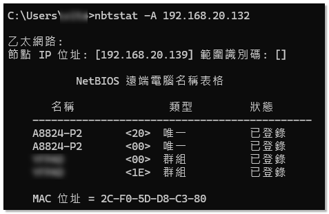

## nbtstat

這個指令可以用來查詢 NetBIOS over TCP/IP 的相關資訊，例如遠端主機的 NetBIOS 名稱、MAC 位址等。

```bash
nbtstat -A 192.168.20.139
```




## netstat

這個指令可以用來顯示目前系統的網路連線狀態，包括開啟的連接、監聽的埠號、路由表等資訊。
```bash
netstat -an
```